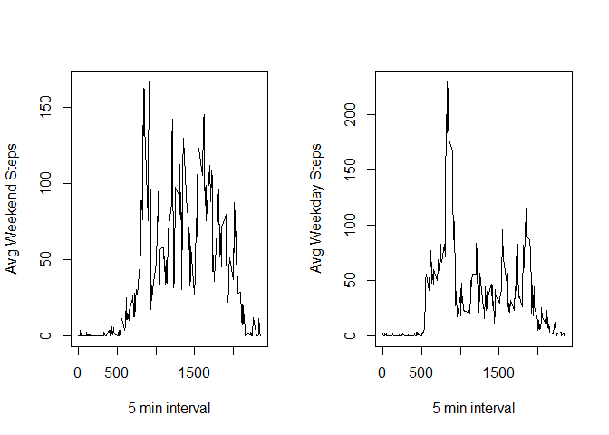

## Loading and preprocessing the data

```r
#load all required library
library(dplyr)
```

```
## Warning: package 'dplyr' was built under R version 3.6.3
```

```
## 
## Attaching package: 'dplyr'
```

```
## The following objects are masked from 'package:stats':
## 
##     filter, lag
```

```
## The following objects are masked from 'package:base':
## 
##     intersect, setdiff, setequal, union
```

```r
library(ggplot2)

# Download the zipped file to a temporary file.
temp <- tempfile()
download.file("https://d396qusza40orc.cloudfront.net/repdata%2Fdata%2Factivity.zip",temp)

# Read the data from temp and remove the temp connection.
actData <- read.csv(unz(temp, "activity.csv"), header = TRUE)
unlink(temp)

# calculate total no of steps taken per day excluding NA
sumData <- actData %>% group_by(date) %>% summarise(DailySteps = sum(steps, na.rm = TRUE))

# calculate average no of steps taken in 5 min interval daily
avgData <- actData %>% group_by(interval) %>% summarise(AvgSteps = mean(steps, na.rm = TRUE))

#Fill missing data with mean of 5 min interval
fillData <- merge(actData, avgData)
fillData$steps <- ifelse(is.na(fillData$steps), fillData$AvgSteps, fillData$steps)

# Calculate total no of steps taken per day after imputing data.
finalData <- fillData %>% group_by(date) %>% summarise(DailyTotstep = sum(steps))

# Add column for day type
fillData$daytype <- as.factor(if_else(weekdays(as.Date(as.character(fillData$date))) %in% c('Saturday','Sunday'), "Weekend", "Weekday"))

# Calculate AvgSteps for both day type
Daytype <- fillData %>% group_by(daytype, interval) %>% summarise(AvgSteps = mean(steps))
```

## What is mean total number of steps taken per day?

```r
#Print mean and median of total no of steps per day
sprintf("Mean of Total number of steps taken per day - %f", mean(sumData$DailySteps) )
```

```
## [1] "Mean of Total number of steps taken per day - 9354.229508"
```

```r
sprintf("Median of Total number of steps taken per day - %f", median(sumData$DailySteps) )
```

```
## [1] "Median of Total number of steps taken per day - 10395.000000"
```

```r
#Print 5 min interval with max no fo steps
maxdata <- avgData[avgData$AvgSteps==max(avgData$AvgSteps),]
sprintf("Max no of steps occurs on - %i interval", maxdata$interval)
```

```
## [1] "Max no of steps occurs on - 835 interval"
```

## What is the average daily activity pattern?

```r
#Plot histogram of daily total steps
hist(sumData$DailySteps, main="Daily Activity Pattern", xlab="Total Steps per Day", ylab="Frequency", col="orange")
```

<!-- -->

```r
#Plot line graph of average steps in 5 mn interval
plot(x=avgData$interval, y=avgData$AvgSteps, type="l", main="Steps Graph", xlab="Interval", ylab="Steps", col="blue")
```

<!-- -->

## Imputing missing values

```r
#Print mean and median of total no of steps per day
sprintf("Mean of Total steps taken per day after imputing data- %f", mean(finalData$DailyTotstep) )
```

```
## [1] "Mean of Total steps taken per day after imputing data- 10766.188679"
```

```r
sprintf("Median of Total steps taken per day after imputing data- %f", median(finalData$DailyTotstep) )
```

```
## [1] "Median of Total steps taken per day after imputing data- 10766.188679"
```

```r
#Plot histogram
hist(finalData$DailyTotstep, main="Daily Activity with Imputing Data", xlab="Total Steps per Day", ylab="Frequency", col="red")
```

<!-- -->

## Are there differences in activity patterns between weekdays and weekends?

```r
# Plot panel - line type
par(mfrow = c(1,2))
with(Daytype[Daytype$daytype == "Weekend", ], 
     plot(interval, AvgSteps, type = 'l', xlab = '5 min interval', ylab = 'Avg Weekend Steps'))
with(Daytype[Daytype$daytype == "Weekday", ],
    plot(interval, AvgSteps, type = 'l', xlab = '5 min interval', ylab = 'Avg Weekday Steps'))
```

<!-- -->
